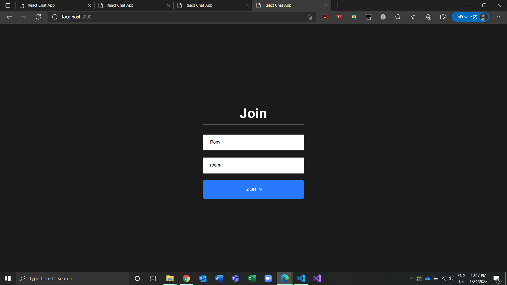
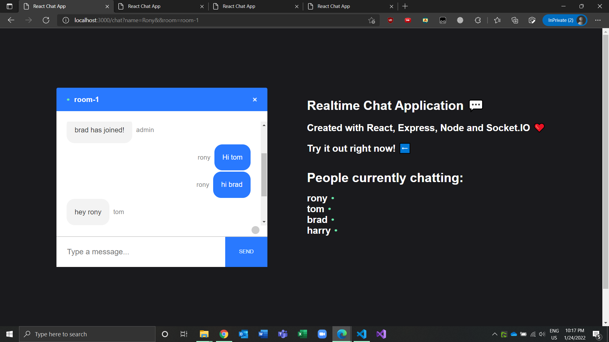

# Realtime Chat Application:

---

A realtime chat application built with Reactjs,nodejs and socketio.

# Main Features:

---

- Users can Join any room by providing a room name and a username
- After joining the room they will see all the active members on the right side of the chat room screen.
- If any other user joins this room the active member list will
  be updated realtime.
- All the chats will be updated realtime.

# Screenshots:

---

Join Room Screen:



Chat Room Screen:



# Installation and setup instructions:

---

First clone down this repository. You will need node and npm globally installed on your machine. Also to run server you need nodemon installed globaly on your machine.

To run the server go to the server directory and type the following command.

```
npm install & npm start
```

this will let the server running.

To run the client go to the client directory and type the following command.

```
npm install & npm start
```

now go to your favorite browser and on the search bar type

```
locahost:3000
```

This will let your app start running.
